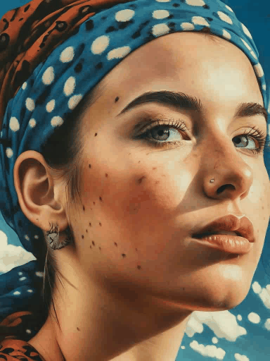
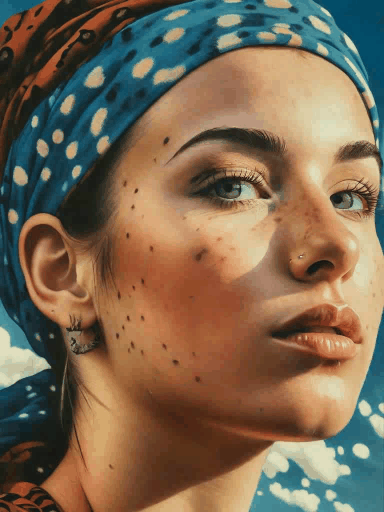

# Video Diffusion Models Experiments

Here we push the boundaries of video generation using diffusion models. This repo will serve as a collection of techniques, including the use of IP Adapters and other methodologies for generating high-quality videos from models traditionally trained for image generation but ofcourse not limited to this.

## Using IP Adapters for Video Generation

I use IP Adapters to condition a T2I model (normally designed for image generation) and trick it into generating video frames. This is achieved by utilizing denoising steps across a large number of samples, allowing the model to generate a somewhat smooth video when combined with an interpolation algorithm.

| Video generation A | Video generation B | Smoothing and stuff | bicubic interpolation | 
| ------------------ | ------------------ | ------------------- | --------------------- | 
|  |  |  |  |

For Inference, `cd ./adapter_interpolation` and run the `inference.py` for further instruction refer to the folder itself !

## Future Experiments

**1.** I have some ideas with SVDs, since its just a SD2.1 underneath, there's a lot to explore there

**2.** FreeNoise? I don't really like how FreeNoise works but it is proven that it kinda smooths out the video so i might try it with some of the experiments 

**3.** FIFO-SVD? I really like SVD just because of the simplicity of it, I might try getting FIFO to work with SVD

**4.** diffusion process comes with a lot of issues, specially the latent space, there's been a bunch of models that are now ditching the VAE altogether, I'll surely try that

**5.** migrate to Flow Matching based models, try ip-adapter approach with FLUX, once a real ip-adapter is out for it 

**6.** 16 channel VAEs? 
---

